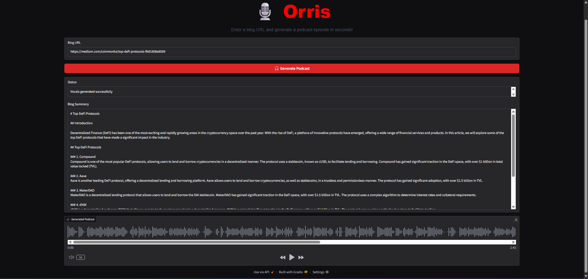

# 🎙️ Orris  

Orris is a cutting-edge AI-powered web application that transforms any **blog, article, or research paper URL** into professional-quality audio🎧.  
Leveraging the power of **CrewAI multi-agent systems**, it automatically processes content and generates realistic voiceovers using **ElevenLabs**.  


# Demo

https://github.com/user-attachments/assets/7cac997c-df26-4b17-b330-ff92bdac4a92


## Features  

### 🎯 Core Functionality  
- 🌐 **Universal URL Support** – Process any blog, article, or research paper URL  
- 🤖 **Intelligent Multi-Agent Pipeline** – Automated content processing with specialized AI agents  
- 🎧 **Instant Audio Playback** – Listen to generated podcasts directly in your browser  
- ⚡ **Real-time Processing** – Watch as your content transforms step by step  

### 🧠 AI Agents Breakdown  
- 🔍 **Scraper Agent** – Expertly extracts and cleans blog text content  
- 📊 **Summarizer Agent** – Intelligently condenses content while preserving key insights  
- 🎙️ **Voice Agent** – Generates natural-sounding podcast audio with ElevenLabs  

### 🎨 User Experience  
- 💫 **Modern & Responsive UI** – Built with Gradio Blocks for seamless interaction  
- 🎯 **One-Click Generation** – Simple workflow with professional results  
- 📥 **Easy Download** – Save your generated podcasts for offline listening  


## 🛠️ Tech Stack  

- [CrewAI](https://github.com/joaomdmoura/crewai) – Multi-agent orchestration and task management  
- [ElevenLabs](https://elevenlabs.io) – State-of-the-art AI voice generation  
- [Gradio](https://gradio.app) – Modern web UI framework with real-time updates  
- [ScrapingDog](https://scrapingdog.com) – Web scraping API for clean content extraction  


## ⚙️ Environment Variables  

Create a `.env` file in your project root with the following keys:  

```bash
SCRAPINGDOG_API_KEY=your_scrapingdog_key_here
HUGGINGFACE_API_KEY=your_huggingface_key_here
ELEVENLABS_API_KEY=your_elevenlabs_key_here
CREWAI_TRACING_ENABLED=true
```

## 🎯 Use Cases  

### 📚 Education & Research  
- Convert research papers into audio for learning on-the-go  
- Create podcast versions of academic articles  


### 🎧 Content Consumption  
- Listen to blog posts during commute or exercise  
- Multi-task while staying updated with informative content  


### ♿ Accessibility  
- Assist visually impaired users in consuming written content  

# UI Preview


